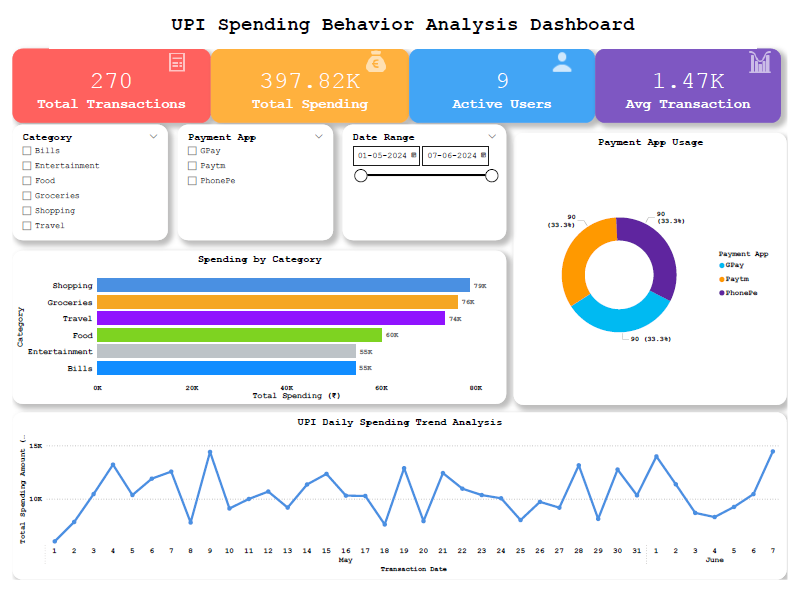

# 📊 UPI Spending Behavior Analyzer

## 🚀 Project Overview

The **UPI Spending Behavior Analyzer** is a data analytics project built using SQL and Power BI to understand user transaction patterns and spending behavior.

This project focuses on transforming raw transaction data into meaningful insights through data cleaning, aggregation, and interactive visualization.

---

## 🎯 Objectives

* Analyze user spending patterns across different categories
* Track daily transaction trends
* Identify high-spending users and usage behavior
* Build an interactive dashboard for data-driven insights

---

## 🛠️ Tech Stack

* **SQL (Oracle)** – Data cleaning, transformation, and querying
* **Power BI** – Dashboard creation and data visualization
* **Excel/CSV** – Dataset handling

---

## 📂 Project Structure

upi-spending-analysis/
│
├── dataset/
│   └── upi_transactions.csv
│
├── sql/
│   └── queries.sql
│
├── dashboard/
│   └── upi_dashboard.pbix
│
├── images/
│   └── dashboard_preview.png
│
└── README.md

---

## 📊 Dashboard Features

* 🔹 KPI Cards (Total Spending, Total Transactions, Average Spend)
* 🔹 Category-wise Spending Analysis (Bar Chart)
* 🔹 Payment App Distribution (Donut Chart)
* 🔹 Daily Spending Trend (Line Chart)
* 🔹 Interactive Slicers (Category, Payment App, Date)

---

## 📈 Key Insights

* Identified top spending categories such as Food, Shopping, and Bills
* Observed daily spending patterns and transaction fluctuations
* Compared transaction volume across different UPI apps
* Segmented users based on spending behavior

---

## 🖼️ Dashboard Preview

---

## ⚙️ How to Run the Project

1. Import the dataset into your SQL database
2. Run the SQL queries for data analysis
3. Connect Power BI to the database
4. Build and interact with the dashboard

---

## 💡 Future Enhancements

* Add predictive analytics for spending trends
* Build real-time data integration
* Enhance user segmentation with advanced metrics

---

## 🙌 Author

**Malini Selvi**

